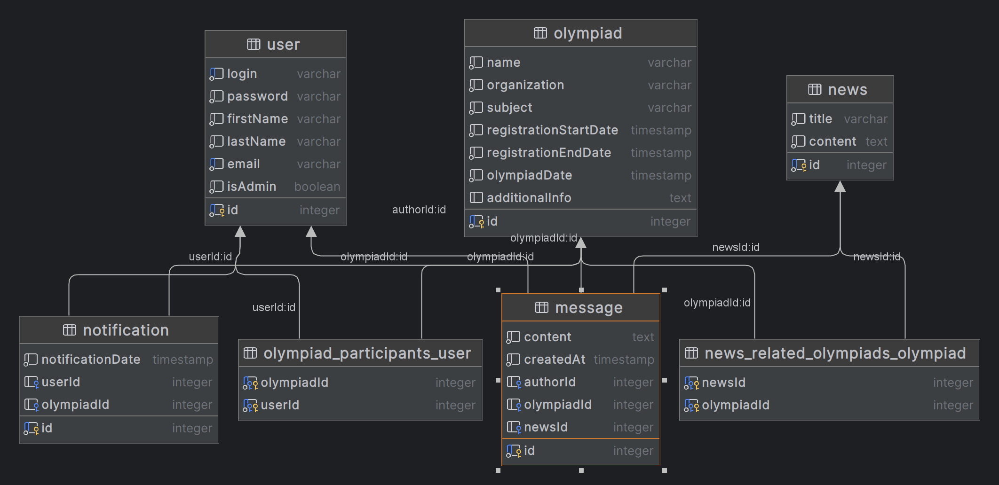

## Сайт по олимпиадам в Якутии
## Макаров Денис Иванович, M3301, sinedmv

Ссылка на сайт: https://m3301-makarov.onrender.com

## Описание доменной области

Основная цель системы — предоставить пользователям возможность  получать актуальные новости и оставлять комментарии. Система также поддерживает уведомления пользователей о важных событиях, связанных с олимпиадами.

## Выделенные сущности

1. **Пользователь (User)**
    - **Описание**: Представляет зарегистрированного пользователя системы.
    - **Атрибуты**:
        - Логин (login)
        - Пароль (password)
        - Имя (firstName)
        - Фамилия (lastName)
        - Электронная почта (email)
        - Администратор (isAdmin)

2. **Олимпиада (Olympiad)**
    - **Описание**: Представляет олимпиаду, в которой могут участвовать пользователи.
    - **Атрибуты**:
        - Название (name)
        - Организация (organization)
        - Школьный предмет (subject)
        - Дата начала регистрации (registrationStartDate)
        - Дата окончания регистрации (registrationEndDate)
        - Дата проведения олимпиады (olympiadDate)
        - Дополнительная информация (additionalInfo)

3. **Новость (News)**
    - **Описание**: Представляет новость, связанную с олимпиадами.
    - **Атрибуты**:
        - Заголовок (title)
        - Текст (content)
        - Связанные олимпиады (relatedOlympiads)

4. **Сообщение (Message)**
    - **Описание**: Представляет комментарий, оставленный пользователем под олимпиадой или новостью.
    - **Атрибуты**:
        - Текст (content)
        - Время создания (createdAt)
        - Автор (author)
        - Связанная олимпиада (olympiad)
        - Связанная новость (news)

5. **Оповещение (Notification)**
    - **Описание**: Представляет уведомление для пользователя о предстоящих событиях, связанных с олимпиадами.
    - **Атрибуты**:
        - Пользователь (user)
        - Олимпиада (olympiad)
        - Дата уведомления (notificationDate)

## Дополнительные таблицы, создаваемые TypeORM

1. **news_related_olympiads_olympiad**
    - **Описание**: Эта таблица создается для реализации связи "многие ко многим" между новостями и олимпиадами. Она позволяет связывать несколько олимпиад с одной новостью и наоборот.

2. **olympiad_participants_user**
    - **Описание**: Эта таблица создается для реализации связи "многие ко многим" между олимпиадами и пользователями. Она позволяет отслеживать, какие пользователи участвуют в каких олимпиадах.